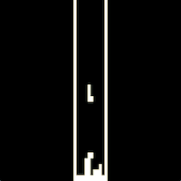

# chip8cpp
Yet another C++ Chip8 interpreter with SDL2 rendering and terminal boops for sound.

## Motivation

Chip8 is the "hello world" of emulators.

I was comparing the difficulty of writing this to 15-122's final assignment C0VM. I took 2-3 nights, I think we give people 2 weeks for C0VM. If we handled all the interface stuff like in e0, this is actually easier but potentially more rewarding. You get to play a bunch of ROMs!

But the issues are:

- C0VM is good concept scaffolding for 213, maybe compilers. Furthermore, C0VM difficulty is nicely tiered, whereas Chip8 difficulty is in implementing DXYN and overall emulator design
- They currently can test against their old code anyway, which is cool enough
- No testing infrastructure for Chip8 and I don't think anybody is interested in writing test ROMs
- Perhaps most importantly, Chip8 games suck. Not so fun after all...

Overall verdict: not worth proposing as a replacement. Worth suggesting as something for bored people to do, I suppose.

## Screenshots

   

## Usage

0. Clone the repo and go to its root
1. mkdir build
2. cd build
3. cmake ..
4. make
5. ./chip8cpp ../roms/ROM_NAME

## Notes

There are two main resources for Chip8 specifications, [mattmik](http://mattmik.com/files/chip8/mastering/chip8.html) and [Cowgod](http://devernay.free.fr/hacks/chip8/C8TECH10.HTM). Various despairing posts on Reddit will tell you that you should listen to mattmik for accurate Chip8 emulation, e.g. for the 8XY6 and 8XY6 instructions, but in practice most of the ROMs available were written according to Cowgod's specification. This includes the BC_Test.ch8 test ROM that you might see floating around.

